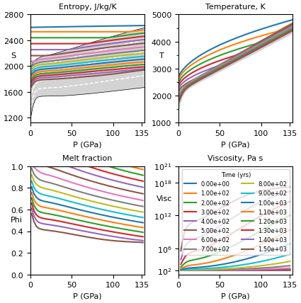

# SPIDER
**Simulating Planetary Interior Dynamics with Extreme Rheology**


[](https://github.com/djbower/spider/actions)
[](https://doi.org/10.5281/zenodo.5682523)


A 1-D parameterised interior dynamics code for rocky planets with molten and/or solid interiors and support for volatile cycling, redox reactions, and radiative transfer in the atmosphere.

## 1. References

#### 1. SPIDER code (interior dynamics)
Bower, D.J., P. Sanan, and A.S. Wolf (2018), Numerical solution of a non-linear conservation law applicable to the interior dynamics of partially molten planets, Phys. Earth Planet. Inter., 274, 49-62, doi: 10.1016/j.pepi.2017.11.004, arXiv: <https://arxiv.org/abs/1711.07303>, EarthArXiv: <https://eartharxiv.org/k6tgf>

#### 2. MgSiO3 melt data tables (RTpress) within SPIDER
Wolf, A.S. and D.J. Bower (2018), An equation of state for high pressure-temperature liquids (RTpress) with application to MgSiO3 melt, Phys. Earth Planet. Inter., 278, 59-74, doi: 10.1016/j.pepi.2018.02.004, EarthArXiv: <https://eartharxiv.org/4c2s5>

#### 3. Volatile and atmosphere coupling
Bower, D.J., Kitzmann, D., Wolf, A.S., Sanan, P., Dorn, C., and Oza, A.V. (2019), Linking the evolution of terrestrial interiors and an early outgassed atmosphere to astrophysical observations, Astron. Astrophys., 631, A103, doi: 10.1051/0004-6361/201935710, arXiv: <https://arxiv.org/abs/1904.08300>

#### 4. Redox reactions
Bower, D.J., Hakim, K., Sossi, P.A., and Sanan, P. (2022), Retention of water in terrestrial magma oceans and carbon-rich early atmospheres, Planet. Sci. J., 3, 93, doi: 10.3847/PSJ/ac5fb1, arXiv: <https://arxiv.org/abs/2110.08029>

## 2. Quick Installation

Here we provide a short installation guide to get you up and running with SPIDER.  First, we install PETSc which provides the solver library and then we install SPIDER.  Finally, we can (optionally) install a [test harness](https://github.com/sciath/sciath).

1. Test you have a valid C compiler installed by running the following command in a terminal window (install a C compiler if this command fails):

    ```
    echo '#include<stdio.h>' > t.c && echo 'int main(){printf("It seems to work!\n");}' >> t.c && gcc t.c && ./a.out && rm -f t.c a.out
    ```

2. If you are already a user of PETSc, comment out any existing references to `PETSC_DIR` and `PETSC_ARCH` in your`.profile`, `.bash_profile`,`.bashrc`, etc. and clear these variables from your current terminal session.


3. Download PETSc.  Use this specific version as given below if interested in reproducing previous results, though any version of PETSc greater than or equal to 3.17 is expected to work just as well.

    ```
    cd /somewhere/to/install
    git clone https://gitlab.com/petsc/petsc -b main petsc-double
    cd petsc-double
    git checkout 63b725033a15f75ded7183cf5f88ec748e60783b
    ```
4. Configure PETSc:

    ```
    ./configure --with-debugging=0 --with-fc=0 --with-cxx=0 --with-cc=gcc --download-sundials2 --download-mpich --COPTFLAGS="-g -O3" --CXXOPTFLAGS="-g -O3"
    ```

5. Follow the terminal instructions to complete the installation of PETSc.  You can copy-paste the commands returned to you in the terminal window.  Make note of `PETSC_DIR` and `PETSC_ARCH`, which are also reported in the terminal window.

6. In your environment, set `PETSC_DIR` and `PETSC_ARCH` to the PETSc installation.  `PETSC_ARCH` will look something like arch-xxx-yyy (e.g. arch-darwin-c-opt).  This completes the setup of PETSc:

    ```
    export PETSC_DIR=/somewhere/to/install/petsc-double
    export PETSC_ARCH=arch-xxx-yyy
    ```

7. Now download SPIDER:

    ```
    cd /somewhere/to/install
    git clone https://github.com/djbower/spider.git
    cd spider
    ```

8. Make SPIDER:

    ```
    make clean
    make -j
    ```

    SPIDER is now installed and you can in principle skip to *Running a Model* below.  However, you are advised to install the test harness as follows:

9. [Optional] Get SciATH (Scientific Application Test Harness), which is a Python module:

    ```
    cd /somewhere/to/install
    git clone https://github.com/sciath/sciath -b dev
    ```

10. [Requires SciATH] Add the resulting module to your Python path (for example):

    ```
    export PYTHONPATH=$PYTHONPATH:$PWD/sciath
    ```

11. [Requires SciATH] Now return to the root SPIDER directory and test basic functionality:

    ```
    make test
    ```

12. [Requires SciATH] You can also run all available tests by navigating to the `tests/` directory and running:

    ```
    python -m sciath tests.yml
    ```

You should now be ready to use the code.  Proceed to *Running a Model* to learn how to run a basic model and use SPIDER options files.

## 3. Running a Model

1. [Optional] Add the installation directory of SPIDER to your `$PATH` so you can call the `spider` binary without requiring the absolute path.
2. You can run `spider` without an argument and standard parameters will be used to run a basic interior model with output stored in ```output/```:

    ```
    spider
    ```

3. However, in general you will add an argument to use the parameters specified in an options file.  For example, from the root SPIDER directory:

    ```
    spider -options_file tests/opts/blackbody50.opts
    ```

4. There are example options files in ```tests/opts/```.  Also see ```parameters.c``` for more parameter options.

5. A python script ```py/plot_spider_lite.py``` can be used to generate a basic figure of the interior profiles.  Run ```py/plot_spider_lite.py -h``` to see the optional arguments.  Running the script on the output data of ```blackbody50.opts``` will generate the following plot:



## 4. Detailed Installation

The following section provides more general information about the installation process, and in particular provides the steps for installing SPIDER with support for quadruple precision calculations.

Installation of SPIDER and its dependencies requires:

1. A working C compiler
2. Build dependencies (double or quadruple precision)
3. Build SPIDER

#### 4.1 C Compiler

Any C compiler can be used if you want to build SPIDER for double precision calculations.  However, for quadruple precision calculations you will need a GCC compiler.  Unfortunately on a Mac, "`gcc`" is a wrapper for the default Apple compiler ("`clang`") which is not actually a GCC compiler package and hence does not support quadruple precision math.  Particularly for Mac OSX you may choose to install GCC to support both double and quadruple precision calculations using a single compiler.

A basic test to ensure you have a working compiler is (note you can swap out "`gcc`" for another compiler binary name):

```
echo '#include<stdio.h>' > t.c && echo 'int main(){printf("It seems to work!\n");}' >> t.c && gcc t.c && ./a.out && rm -f t.c a.out
```

For Mac OSX, the easiest way to install GCC is from <http://hpc.sourceforge.net>

If you use MacPorts, Homebrew, or apt, these can also be used to install GCC.  *Unfortunately, the GCC compiler from Macports seems to be frequently broken*.  Nevertheless, for example, using MacPorts:

```
sudo port install gcc8
```

This will install a set of GCC binaries, typically in "`/opt/local/bin`".  The C compiler (for GCC8) will be called "`gcc-mp-8"` where the mp is obviously clarifying that it was installed by MacPorts.
Now on a Mac, you will usually access the default Apple compiler ("`clang`") using "`gcc`", but you can easily access the MacPorts GCC you just installed by using "`gcc-mp-8`" instead.  *So when you are installing the software in the next sections, just use "`gcc-mp-8`" instead of "`gcc`" when you are asked to specify the C compiler.*

You can check the version of your compiler (for example):

```
gcc --version
gcc-mp-8 --version
```

If you see a message about "Apple LLVM" then your compiler will not support quadruple precision.  You can also test with this command (replace `gcc` by `gcc-mp-8` to test the MacPorts compiler):

```
echo '#include<stdio.h>' > t.c && echo '#include<quadmath.h>' >> t.c && echo 'int main(){printf("It seems to work!\n");}' >> t.c && gcc t.c && ./a.out && rm -f t.c a.out
```

#### 4.2 Build Dependencies (Quadruple Precision)

**For double precision, you can follow *Quick Installation* to install PETSc, which will also install SUNDIALs.**

Before you begin, comment out any existing references to `PETSC_DIR` and `PETSC_ARCH` in your
`.profile`, `.bash_profile`,`.bashrc`, etc. and clear these variables from your current terminal session.

For quadruple precision, you must install SUNDIALS independently of PETSc, since we use a modified version of SUNDIALS to support quadruple precision.

#### 4.2.1 Install SUNDIALS with quadruple precision

1. Clone this specific, modified version of SUNDIALS from the Git repository:

    ```
    cd /somewhere/to/install
    mkdir src
    git clone https://bitbucket.org/psanan/sundials-quad src
    ```

2. Make sure that you have CMake available by typing `cmake --version`.  If this fails, then install CMake from your package manager (homebrew, macports, apt,..) or by following [the instructions from CMake](https://cmake.org/download).  Note: it is necessary to comment out the `cmake_policy(SET CMP0042 NEW)` in `src/CMakeLists.txt` if you are using an old version of CMake.

    ```
    sudo port install cmake           # MacPorts
    brew install cmake                # Homebrew
    sudo apt-get install cmake        # apt
    ```

3. Configure, build, and install SUNDIALS:

    ```
    mkdir install build
    cd build
    cmake ../src
    ccmake .            # with apt you may need to install this separately
    ```

4.  Use the `ccmake` interface to set values similar to those below.
Make sure you type "c" to configure once you have entered these values, then "g" to generate and exit.
Note: specify the same C compiler you used to install PETSc (probably `gcc`):

    ```
    CMAKE_C_COMPILER: gcc
    CMAKE_INSTALL_PREFIX: ../install
    EXAMPLES_INSTALL_PATH: ../install/examples
    SUNDIALS_PRECISION: quadruple
    ```

5. Make and install:

    ```
    make && make install
    ```

#### 4.2.2 Install PETSc with quadruple precision


6. Download PETSc.  Use this specific version as given below if interested in reproducing previous results, though any version of PETSc greater than or equal to 3.17 is expected to work just as well.

    ```
    cd /somewhere/to/install
    git clone https://gitlab.com/petsc/petsc -b main petsc-quad
    cd petsc-quad
    git checkout 63b725033a15f75ded7183cf5f88ec748e60783b
    ```

7. Configure PETSc using the following command.  Crucially, in the next step we point PETSc to the quadruple precision installation of SUNDIALS that we just created (change `/somewhere/to/install` to the place that you installed SUNDIALS):

    ```
    ./configure --with-debugging=0 --with-fc=0 --with-cxx=0 --with-cc=gcc --with-precision=__float128 --with-sundials=1 --with-sundials-dir=/somewhere/to/install/sundials-quad/install --download-mpich --download-f2cblaslapack --COPTFLAGS="-g -O3" --CXXOPTFLAGS="-g -O3"
    ```

8. Follow the terminal instructions to complete the installation of PETSc.  You can copy-paste the commands returned to you in the terminal window.  Make note of `PETSC_DIR` and `PETSC_ARCH`, which are also reported in the terminal window.

9. In your environment, set `PETSC_DIR` and `PETSC_ARCH` to the PETSc installation.  `PETSC_ARCH` will look something like arch-xxx-yyy (e.g. arch-darwin-c-opt).  This completes the setup of PETSc:

    ```
    export PETSC_DIR=/somewhere/to/install/petsc-quad
    export PETSC_ARCH=arch-xxx-yyy
    ```

#### 4.2.3 Install SPIDER

10. Now download SPIDER:

    ```
    cd /somewhere/to/install
    git clone https://github.com/djbower/spider.git
    cd spider
    ```

11. Make SPIDER:

    ```
    make clean
    make -j
    ```

12. Test basic functionality:

    ```
    make test
    ```

You should now be ready to use the code!

## 5. Other


#### 5.1 Extended notes

There are extended notes located in `notes/` that are useful for understanding the methodology and source code of SPIDER.  You can compile `notes.tex` using `pdflatexmk` or `pdflatex`.

## Copyright

See [The included license](COPYING).
Copyright 2021 Daniel J. Bower and Patrick Sanan
